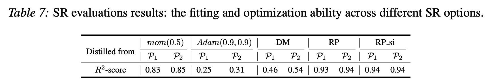

# Symbolic Learning to Optimize

This is the official implementation for ICLR-2022 paper "Symbolic Learning to Optimize: Towards Interpretability and Scalability"

# Introduction

Recent studies on Learning to Optimize (L2O) suggest a promising path to automating and accelerating the optimization procedure for complicated tasks. Existing L2O models parameterize optimization rules by neural networks, and learn those numerical rules via meta-training. However, they face two common pitfalls: (1) scalability: the numerical rules represented by neural networks create extra memory overhead for applying L2O models, and limits their applicability to optimizing larger tasks; (2) interpretability: it is unclear what each L2O model has learned in its black-box optimization rule, nor is it straightforward to compare different L2O models in an explainable way. To avoid both pitfalls, this paper proves the concept that we can ``kill two birds by one stone'', by introducing the powerful tool of symbolic regression to L2O. In this paper, we establish a holistic symbolic representation and analysis framework for L2O, which yields a series of insights for learnable optimizers. Leveraging our findings, we further propose a lightweight L2O model that can be meta-trained on large-scale problems and outperformed human-designed and tuned optimizers. Our work is set to supply a brand-new perspective to L2O research.

# Our approach:

First train a neural network (LSTM) based optimizer, then leverage the symbolic regression tool to trouble shoot and analyze the neural network based optimizer. The yielded symbolic rule serve as a light weight light-weight surrogate of the original optimizer.

# Our main findings:

##### Example of distilled equations from DM model:

##### Example of distilled equations from RP model (they are simpler than the DM surrogates, and yet more effective for the optimization task):

##### Distilled symbolic rules fit the optimizer quite well:

##### Distilled symbolic rules perform same optimization task well, compared with the original numerical optimizer:

##### The light weight symbolic rules are able to be meta-tuned on large scale (ResNet-50) optimizee and get good performance:

##### The symbolic regression passed the sanity checks in the optimization tasks:

# Installation Guide

The installation require no special packages. The `tensorflow` version we adoped is `1.14.0`, and the `PyTorch` version we adopted is `1.7.1`.

# Training Guide

The three files: 

`torch-implementation/l2o_train_from_scratch.py`

`torch-implementation/l2o_symbolic_regression_stage_2_3.py`

`torch-implementation/l2o_evaluation.py`

are pipline scripts, which integrate the multi-stage experiments. The detailed usages are specified within these files. We offer several examples below.

- In order to train a rnn-prop model from scratch on mnist classification problem setting with 200 epochs, each epoch with length 200, unroll length 20, batch size 128, learning rate 0.001 on GPU-0, run:
  
  `python l2o_train_from_scratch.py  -m tras   -p mni  -n 200  -l 200   -r 20   -b 128   -lr 0.001  -d 0`

- In order to fine-tune an L2O model on the CNN optimizee with 200 epochs, each epoch length 1000, unroll length 20, batch size 64, learning rate 0.001 on GPU-0, first put the `.pth`  model checkpoint file (the training script above will automatically save it in a new folder under current directory) under the first (0-th, in the python index) location in `__WELL_TRAINED__` specified in `torch-implementation/utils.py` , then run the following script:
  
  `python l2o_train_from_scratch.py  -m tune   -pr 0   -p cnn   -n 200  -l 1000   -r 20   -b 64   -lr 0.001  -d 0`

- In order to generate data for symbolic regression, if desire to obtain 50000 samples evaluated on MNIST classification problem, with optimization trajectory length of 300 steps, using GPU-3, then run:
  
  `python l2o_evaluation.py  -m srgen   -p mni  -l 300  -s 50000  -d 3`

- In order to distill equation from the previously saved offline SR dataset, check and run: `torch-implementation/sr_train.py`

- In order to fine-tune SR equation, check and run: `torch-implementation/stage023_mid2021_update.py`

- In order to convert distilled symbolic equation into latex readable form, check and run: `torch-implementation/sr_test_get_latex.py.py`

- In order to calculate how good the symbolic is fitting the original model, we use the R2-scores; to compute it, check and run: `torch-implementation/sr_test_cal_r2.py`

- In order to train and run the resnet-class optimizees, check and run: `torch-implementation/run_resnet.py`

There are also optional tensorflow implementations of L2O, including meta-training the two benchmarks used in this paper: DM and Rnn-prop L2O. However, all steps before generating offline datasets in the pipline is only supportable with torch implementations. To do symbolic regression with tensorflow implementation, you need to manually generate records (an `.npy` file) of shape `[N_sample, num_feature+1]`, which concatenate the `num_feature` dimensional `x` (symbolic regresison input) and `1` dimensional `y` (output), containing `N_sample` samples. Once behavior dataset is ready, the following steps can be shared with torch implementation.

- In order to train the tensorflow implementation of L2O, check and run: `tensorflow-implementation/train_rnnprop.py`, `tensorflow-implementation/train_dm.py`

- In order to evaluate the tensorflow implementation of L2O and generate offline dataset for symbolic regression, check and run: `tensorflow-implementation/evaluate_rnnprop.py`,  `tensorflow-implementation/evaluate_dm.py`.

# Other hints

#### Meta train the DM/RP/RP_si models

run the `train_optimizer()` functionin `torch-implementation/meta.py`

#### Evaluate the optimization performance:

run the`eva_l2o_optimizer()` function in `torch-implementation/meta.py`

#### RP model implementations:

The`RPOptimizer` in `torch-implementation/meta.py`

#### RP_si model implementations:

same as RP, set `magic=0`； or more diverse input can be enabled by setting `grad_features="mt+gt+mom5+mom99"`

#### DM model implementations:

`DMOptimizer` in `torch-implementation/utils.py`

#### SR implementations:

`torch-implementation/sr_train.py`

`torch-implementation/sr_test_cal_r2.py`

`torch-implementation/sr_test_get_latex.py`

#### other SR options and the workflow:

`srUtils.py`

# Citation

comming soon.